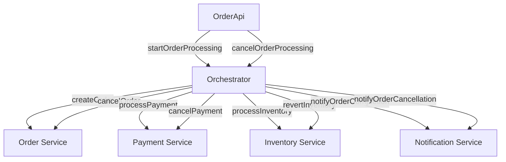

# SagaDemo

Orchestrated saga demo.

The demo consists of several microservices:

1) OrderApi - rest api for accepting orders. API Documentation: localhost:8020/swagger-ui
2) Orchestrator - orchestrator service accepting data from OrderAPI via JMS Queue
3) Order - service for managing orders
4) Payment - payment processing service
5) Inventory - inventory management service
6) Notification - service for handling notifications of completion or cancelling of orders

Additionally added message module for some data classes shared between services.

All services are connected to each other via JMS queues.

## Diagram


## Tech Stack

- Kotlin
- Spring Boot
- Camel
- Artemis
- H2

## Build and run

### Build

- Build the app using gradle wrapper

```
./gradlew clean build
```
### Run

- Run the app using gradlew

```
./gradlew bootRun
```

- Run the app via jar

```
java -jar build/libs/<service-name>.jar
```